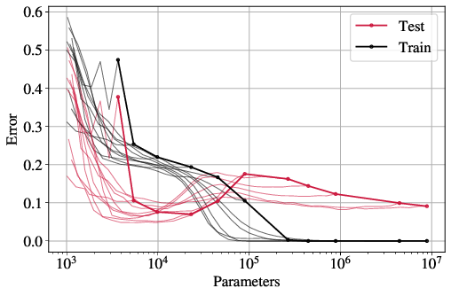
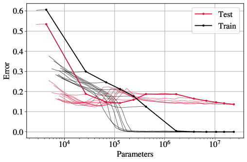

# Quantifying lottery tickets under label noise

This repository implements key experiments on quantifying lottery tickets under label noise presented in the following paper:

Quantifying lottery tickets under label noise: accuracy, calibration, and complexity, Viplove Arora, Daniele Irto, Sebastian Goldt, Guido Sanguinetti (UAI 2023).

MNIST                      |  CIFAR-10
:-------------------------:|:-------------------------:
| 

## Overview
This framework is a fork of the [OpenLTH](https://github.com/facebookresearch/open_lth) project. We adopted most of the original implementations, and made additional modications.

## Getting Started
### Prerequisites
- Python >= 3.6
- PyTorch >= 1.4
- TorchVision >= 0.5.0

### Setup
- Install the requirements.
-  Modify `platforms/local.py` so that it contains the paths where you want datasets and results to be stored. By default, they will be stored in `~/open_lth_data/` and `~/open_lth_datasets/`.

## Experiments
### Two-layer FCN with MNIST
```
python open_lth.py lottery --default_hparams=mnist_lenet_300 --training_steps=120ep --levels=17 --pruning_fraction=0.2 --random_labels_fraction 0.2
```
You can change the number of neurons in the hidden layer by changing the `default_hyperparameter` option and observe the double descent curve. The number of levels of pruning need to be changed accordingly to make sure that the entire sparse double descent curve is observed.

### ResNet-18 with CIFAR-10
```
python open_lth.py lottery --default_hparams=cifar_resent_20_80 --training_steps=160ep --levels=30 --pruning_fraction=0.2 --random_labels_fraction 0.2 --rewinding_steps=10ep
```

## Acknowledgement
We develop our project mainly on the [OpenLTH](https://github.com/facebookresearch/open_lth), which is easy to use and extend. Thanks for the great work!
## Citation
If you find this useful for your research, please cite the following paper.
```
@inproceedings{arora2023quantifying,
  title={Quantifying lottery tickets under label noise: accuracy, calibration, and complexity},
  author={Anonymous},
  booktitle={The 39th Conference on Uncertainty in Artificial Intelligence},
  year={2023},
  url={https://openreview.net/forum?id=YVWw8OSEse}
}
```

## Contact
If you have any question on these codes, please don't hesitate to contact me by viplovearora92@gmail.com
